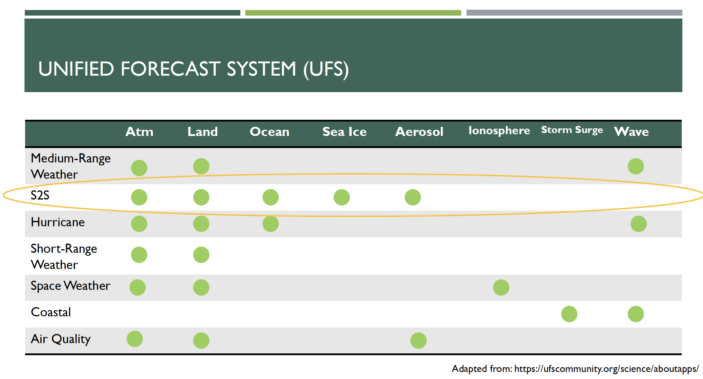
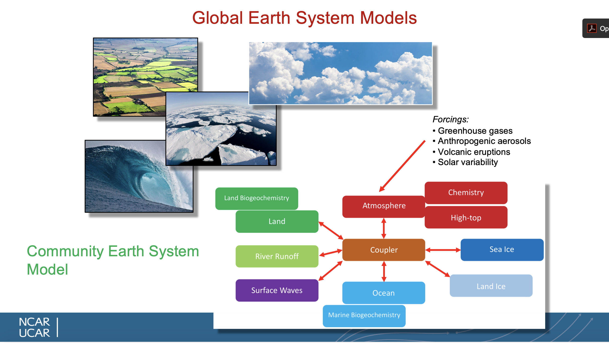

Last week you learned about the NOAA/Unified Forecast System from Dr. Stan.  Today we will learn about the NCAR/Community Earth System Model. How would you know which model you want to use for your work?  Here are some pros/cons of each model.

### NOAA/Unified Forecast System (UFS) 
* Website: https://www.ufscommunity.org/
* UFS is not yet easy to run for research purposes 
* Challenging to modify for a specific purpose, but this will improve in the future – concerted effort to document and provide community support 
* The "public release" version is only the Atm & Land components, although experimental unsupported atm-land-ocn versions exist.
* Existing, publicly available experiments consist of Atm/Land model re-forecasts and real-time forecasts 
* Its primary mission is centered around prediction 
* Components consist of Atm, Land, Ocn, Sea Ic, Aerosol, Ionosphere, Storm Surge, Waves
* Using the UFS for research has the potential to directly feedback to improving operational predictions. 
* Several people in AOES work with this model as a research tool (e.g. Stan, Cash, Kinter) 

### NCAR/Community Earth System Model (CESM)
* Designed for community use -- easy to use for research 
* Large community of people working with CESM – Organized in working groups that are open to all (http://www.cesm.ucar.edu/working_groups/)
* Easy to get help, lots of documentation: (http://www.cesm.ucar.edu/) 
* CESM has different (and more) Earth system components 
* Many components can be combined together in endless combinations 
* Easy to change configuration (e.g. output frequency, grid). 
* Primary mission is climate oriented 
* Many existing climate simulations and now hindcasts (CMIP, large ensemble, decadal prediction, S2S prediction) 
* More recently starting to be used for prediction/predictability purposes (e.g. new Earth System Prediction Working Group). 
* Lots of people in AOES work with this model. 



