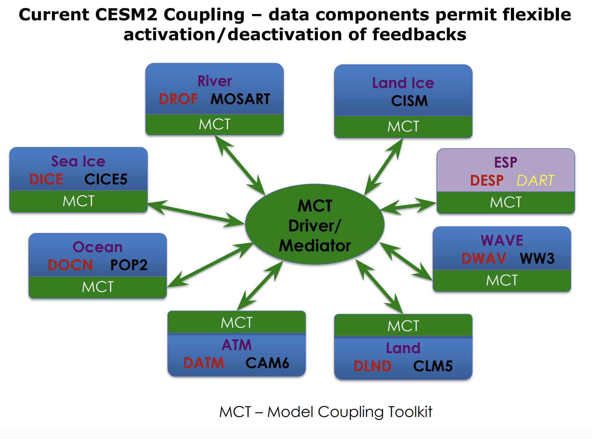
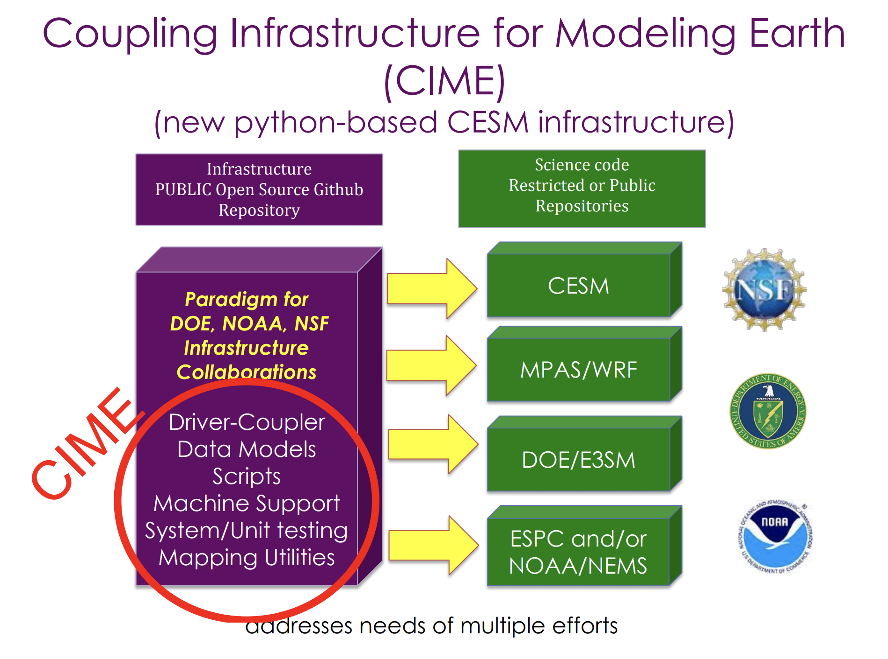

The NCAR/CESM consists of many component models which are their own software programs.  These models talk to each other through another piece of software called a coupler. There is yet even another software system, called the Workflow.  It allows us to select various model components and configurations for our experiments. 

 

### Workflow

The workflow used by CESM is called the Coupling Infrastructure for Modeling Earth (CIME).  It includes:
* Coupling infrastructure (how do the components talk to each other)
* Data and stub models (structure to allow componenets to be active or inactive)
* Testing infrastructure
* Python scripts and XML configuration files for the Case control system (this is what is important to us for running the model)

 

CIME is being used by other modeling groups, so learning how to configure and run the CESM using CIME may translate to being able to work with other models.
