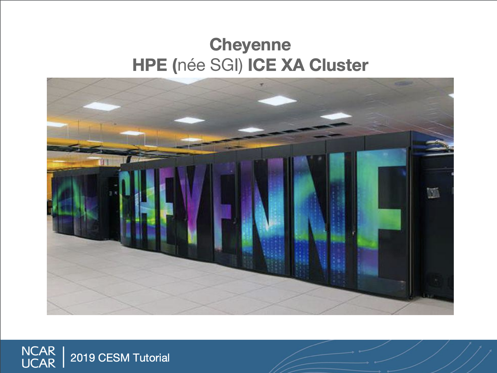
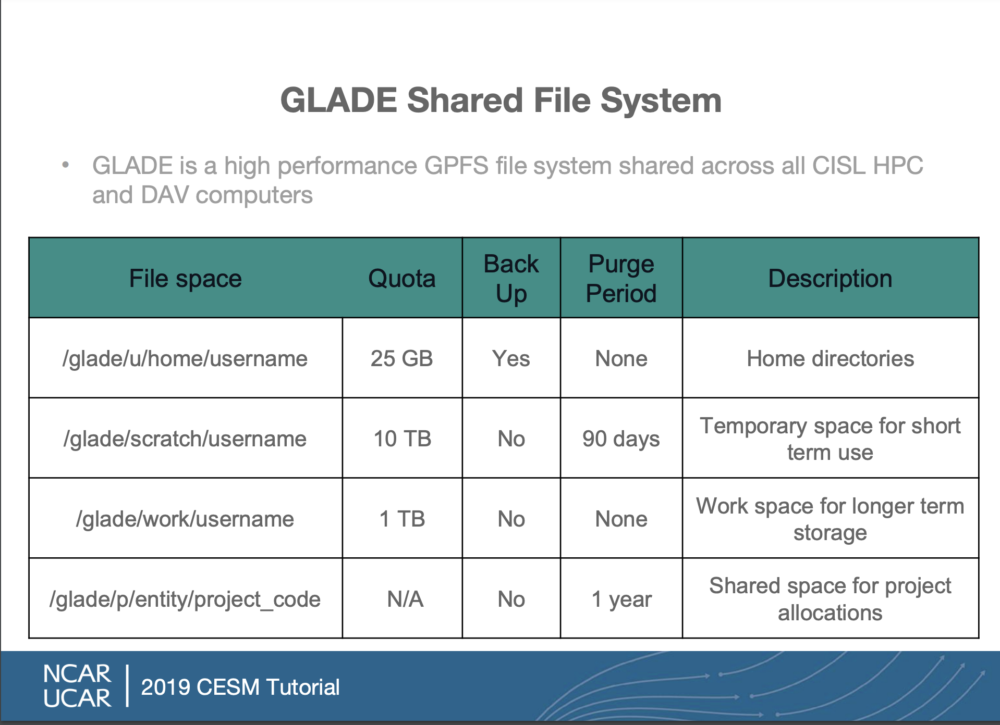

You have now have accounts on the NCAR computers `cheyenne.ucar.edu` and `casper.ucar.edu`.  

Login to `cheyenne` 
~~~
$ ssh -X -l username cheyenne.ucar.edu
~~~
{: .language-bash}

Follow the instructions you received regarding Duo 2-factor authentication

Cheyenne is a supercomputer, but to the user it is just like any Unix computer and we run the same Unix commands here.

> ## Your home directory on NCAR 
>
> Use the `pwd` command to see what your home directory is called.
>
{: .challenge}

To run a model we will need disk space beyond just our home directory.  By default, with your NCAR account, you have space in your home directory, a temporary space called `scratch` and a `work` directory all under a system called the GLADE shared file system.  How do I know what directories I have and how much space is available?

> ## Your disk space on glade  
>
> Use the `gladequota` command to see 
>
> Note that only the home directory is backed up.
>
{: .challenge}

