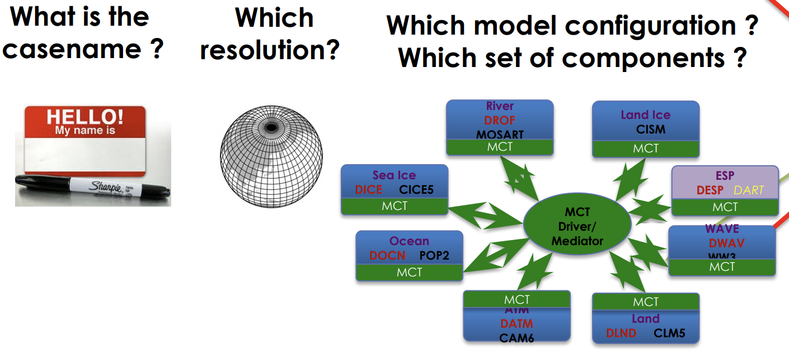

You have now downloaded all the model components and the CIME workflow. Let's take a look:
From your `/glade/work/username/cesm2.1.1` directory, see what is there.
~~~
$ ls
~~~
{: .language-bash}

> ## What was added after running `manage_externals`
>
{: .challenge}

#### Organization of the CESM Directory

CESM has a set of keywords that refer to specific directories, they are:
* `SRCROOT` - Path to your CESM code; contains `CIMEROOT`
* `CIMEROOT` - Path of your CIME directory which is sub-directory under `SRCROOT`
* `CASEROOT` - Path to your case directories 
* `OBJROOT` - Path to your build directory
* `EXEROOT` - Path to your run directory
* `DOUT_S_ROOT` - Path to your archived data directory

> ## Find your SRCROOT and CIMEROOT
>
> Your SRCROOT and CIMEROOT exist after downloading the CESM.  What are the exact paths for you?
>
{: .challenge}

#### CIMEROOT

The cime subdirectory contains a subdirectory called `scripts`.  This is the directory we will use initially for setting up the model.
Change into this subdirectory and take a look.

~~~
$ cd cime/scripts
$ ls
~~~
{: .language-bash}

The final one-time step is to create a directory called `cases` in your home directory.
~~~
$ mkdir ~/cases
~~~
{: .language-bash}

The cases directory (also called your `CASEROOT`) will contain all the source code and configuration files for your model experiments.  
Why do you think we would put something like this in our home directory?

### Model Quickstart

Above were the one-time setup setps, now we move on to the steps you will do everytime to setup a new model experiment and run it.

Go into the scripts subdirectory in your `CIMEROOT`
~~~
$ cd /glade/work/kpegion/cesm2.1.1/cime/scripts
~~~
{: .language-bash}

Create a new case
~~~
$ ./create_newcase --cases ~/cases/b.day1.0 --res f19_g17 --compset B1850 --project UGMU0032
~~~
{: .language-bash}

This created a new subdirectory for your new case. Change to that directory.
~~~
$ cd ~/cases/b.day1.0 
~~~
{: .language-bash}

Setup the case
~~~
$ ./case_setup
~~~
{: .language-bash}

Build the executable (this will take while)
~~~
$ qcmd -- ./case.build
~~~
{: .language-bash}

This will take awhile.  While the model is compiling, we will talk about what the `create_newcase` command did.

> ## Potential Errors
>
> Some users received an error indicating that their account was overspent or expired. This happened to users who already had a NCAR account associated with a project charge code that was no longer available.  To resolve this, set the `PBS_ACCOUNT` environment variable to a valid charge code for this class.
> ~~~
> $ export PBS_ACCOUNT=UGMU0032
> ~~~
> {: .language-bash}
> This setting will go away after you logout, so you will need to set it everytime for the correct project charge code associated with the project you are working on. 
>
{: .callout}

#### What did we just do?

`create_newcase` takes 3 arguments

#### Case Name (`case`)
This is the name and location of your experiment
* Can be anything you want
* It is a good idea to make it descriptive so you can distinguish different cases
* NCAR has reccomended naming conventions

This experiment is called `b.day1.0` and it is located in my cases directory in my home directory.

#### Resoultion (`res`)
Specifies the resolution and grid of the model components.
Each model resolution can be specified by its alias or long name.

How to know what grids are available?
There's a tool

~~~
$ CIMEROOT/scripts/query_config --grids --long 
~~~
{: .language-bash}

and a [website](http://www.cesm.ucar.edu/models/cesm2/config/grids.html)

> ## Understanding grids
>
> The resolution f09_g17 is the standard resolution used for CMIP simulations 
> with the CESM. What is the resolution of the atmosphere/land and ocean in this model?
>
>
{: .challenge}

#### Component Set (`compset`)

Sets which versions and component models are active vs. inactive and what forcings are used.  
The first letter `B` in this compset indicate that all components are active.  The `1850` means that the 1850 greenhouse gas forcings will be used.

How do I know what the different compsets are?

There's a tool

~~~
$ CIMEROOT/scripts/query_config --compsets
~~~
{: .language-bash}

and a [website](http://www.cesm.ucar.edu/models/cesm2/config/compsets.html)

Some Common Compset Starting Characters
* `B` all components are active
* `F` atmosphere is active; ocean and ice are inactive
* `I` land is active
* `G` ocean is active
* `A` aquaplaned (atm with no land)

Certain compsets are `scientifically validated` meaning they have been extensively tested.  
You can create your own compsets.
It is strongly suggested that you start developing any experiments from a scientifically validated compset, then make changes.
The selected compset determines which grids are available.

### The `CASEROOT` directory

This was created when you ran `create_newcase`. Change directory and take a look at it:

~~~
$ cd ~/b.day1.0
$ ls
~~~
It contains a bunch of `.xml` files which are configuration files.  We will learn how to modify them next week.

#### What happened when we ran `case.setup`?
* Your RUNDIR and EXEROOT directories were created
* A bunch of user.nl.xxx files were created (these are namelist files that provide configuraiton details to different component models)
* Created the `case.run` and `case.st_archive` scripts 
* Create a CaseDocs directory

### What happened when we ran `case.build`?
* Checked that all the input data was available
* Created the namelists from the user specified ones above
* Compiled the model

### How can I find out what my CASEROOT, CIMEROOT, etc. are if I forget?
~~~
$ ./xmlquery RUNDIR,EXEROOT,CASEROOT,CIMEROOT
~~~
{: .language-bash}

### Now what?

If your build has completed, then you can submit your model run to the queue.
~~~
$ ./case.submit
~~~
{: .language-bash}

You can see that is is in the queue, using
~~~
$ qstat -u username
~~~
{: .language-bash}

What do we see regarding the model run in the queue?

You can logout now.  While we are away, our model will run.  We will return next week to take a look!

